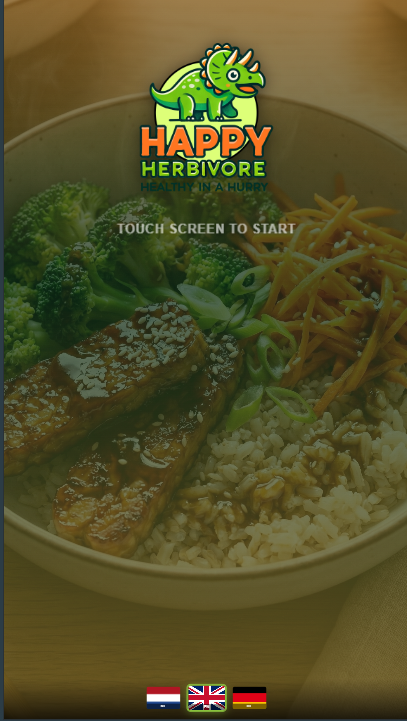

# Happy Herbivore ~ Healthy in a Hurry

## Project Structure

```
TEAM_HARMONY/
│
├── 📁 kiosk-field-research/          # Research materials
│   ├── kiosk-document research.pdf
│   └── kiosk-video2.mp4
│
├── 📁 public/                        # Frontend assets
│   ├── css/
│   │   ├── order-type.css
│   │   ├── product.css
│   │   └── style.css
│   ├── fonts/
│   ├── images/
│   ├── js/
│   │    ├── kiosk-start.js
│   │    └── main.js
│   ├── db.php                            # DB connection
│   ├── get-products.php                  # Product fetcher
│   └── index.php                         # Entry point
│
├── 📁 orders/                        # Order logic
│   ├── order-type.php
│   ├── overview-screen.php
│   ├── place-order.php
│   └── update-status.php
│
├── 📁 products/                      # Product pages
│   └── product-screen.php
│
├── 📁 sql/                           # Database
│   └── kiosk_menu_fixed.sql
│
├── .gitattributes
├── README.md
└── kiosk-eindproductvid2.mp4
```

## Over dit project

Happy Herbivore is een digitaal bestelsysteem voor een gezonde fastcasual zaak, opgebouwd als een kiosk waarop klanten zelf hun bestelling kunnen plaatsen. Naast de klant-kiosk is er ook een apart overzichtsscherm voor het keukenpersoneel, zodat bestellingen direct en overzichtelijk binnenkomen.

## Gebruikte technieken

- **PHP** – backend logica voor bestellingen, producten en database connectie
- **MySQL** – opslag van menu en bestelgegevens (`sql/kiosk_menu_fixed.sql`)
- **HTML/CSS/JavaScript** – frontend van de kiosk (`public/`)

## Kitchen tool

Naast de kiosk voor klanten heeft dit project een apart overzichtsscherm voor het keukenpersoneel (`overview-screen.php`). Hierop zien medewerkers alle binnengekomen bestellingen realtime binnenkomen. Via `update-status.php` kunnen ze de status van een bestelling aanpassen (bijv. van "in behandeling" naar "klaar"), zodat zowel de keuken als de klant weten hoe het ervoor staat.

**Gebruik van de kitchen tool:**
1. Open `overview-screen.php` op een apart scherm/tablet in de keuken
2. Nieuwe bestellingen verschijnen automatisch in het overzicht
3. Klik op een bestelling om de status bij te werken (bijv. "ontvangen" → "wordt bereid" → "klaar")
4. De klant ziet de actuele status op het bestelscherm

## Screenshot / Startscreen



## Hoe gebruik je het

1. Clone deze repository
2. Importeer `sql/kiosk_menu_fixed.sql` in je MySQL database
3. Stel je databasegegevens in via `db.php`
4. Start een lokale server (bijv. via XAMPP of `php -S localhost:8000`)
5. Open `index.php` om als klant een bestelling te plaatsen
6. Open `overview-screen.php` op een tweede scherm/tablet voor het keukenpersoneel